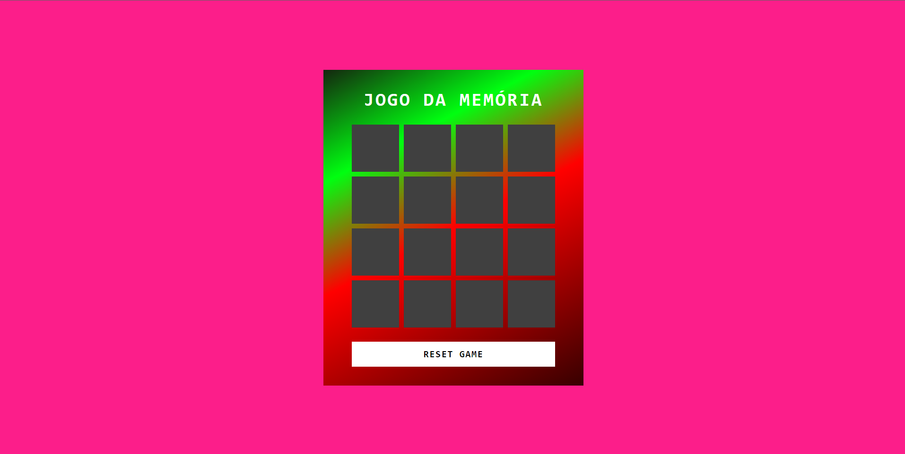

 # Jogo da Memória

 Um jogo simples de memória usando HTML, CSS e JavaScript, com emojis de comida.

 

 ## Sumário

 - [Demo](#demo)
 - [Recursos](#recursos)
 - [Como Jogar](#como-jogar)
 - [Customização](#customização)
 - [Contribuições](#contribuições)
 - [Licença](#licença)

 ## Demo

 Você pode jogar o jogo ao vivo [aqui]([#](https://oyazigi.github.io/memory-game/))

 ## Recursos

 - Jogo de memória divertido e envolvente com emojis de comida.
 - Personalizável com vários temas de emojis de comida.

 ## Como Jogar

 As regras do jogo da memória são simples:

 1. Clique em uma carta para revelar o emoji de comida.
 2. Clique em outra carta para encontrar seu emoji correspondente.
 3. Continue encontrando pares de cartas até que todas sejam reveladas.
 4. Tente terminar o jogo o mais rápido possível com o menor número de movimentos.

 O jogo foi projetado para testar e melhorar suas habilidades de memória. Divirta-se!

 ## Customização

 Você pode personalizar o jogo escolhendo diferentes temas de emojis de comida. Para fazer isso, abra o arquivo `script.js` e procure o array `emojiSet`. Você pode adicionar ou remover opções de emojis para criar seus próprios temas.

 ```javascript
 const emojiSet = [
     "🍔", "🍕", "🍦", "🍭", "🍩", "🍓", "🍒", "🍎"
 ];
 ```

 Sinta-se à vontade para explorar e usar vários emojis de comida para criar uma experiência de jogo única.

 ## Contribuições

 Se você deseja contribuir para este projeto, siga estas etapas:

 1. Faça um fork do repositório.

 2. Crie um novo branch com um nome descritivo:

    ```bash
    git checkout -b feature/sua-feature
    ```

 3. Faça suas alterações e as commit:

    ```bash
    git commit -m "Adicionar sua feature"
    ```

 4. Envie suas alterações para o repositório forkado:

    ```bash
    git push origin feature/sua-feature
    ```

 5. Crie uma solicitação pull para o repositório principal.

 Nós damos as boas-vindas às contribuições, seja para corrigir bugs, adicionar novos recursos ou melhorar a documentação.
 ---
